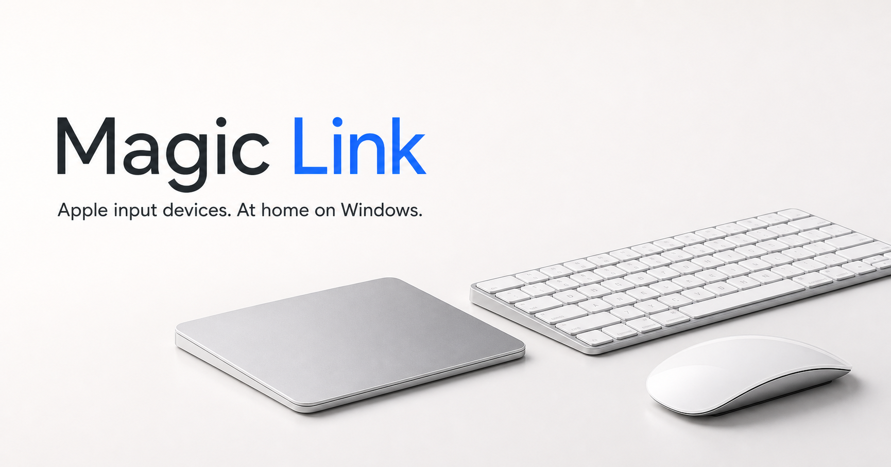

<p align="center">
  <a href="https://magic-link.app/">
    
  </a>
</p>

<h1 align="center">Magic Link for Windows</h1>

<p align="center">
  One app to connect and manage Magic Trackpad, Magic Mouse, and Magic Keyboard on Windows 10 and 11.
</p>

<p align="center">
  <a href="https://magic-link.app/"><strong>Official website</strong></a>
  ·
  <a href="https://magic-link.app/zh-cn">简体中文</a>
  ·
  <a href="https://github.com/sid12333/magiclink/releases">Releases</a>
  ·
  <a href="https://github.com/sid12333/magiclink/issues">Support</a>
</p>

## What Magic Link does

- Provides tracking, clicking, scrolling, zooming, and multi-finger gesture controls for supported Magic Trackpad models.
- Discovers and manages Magic Mouse and Magic Keyboard. Their basic operation uses Windows built-in drivers; advanced Magic Link controls are still in development.
- Supports Windows 10 and Windows 11 on x64 PCs, with wired and Bluetooth connections depending on the device.

## Release status

The first production-signed installer is being prepared. There is no public download yet. When it is ready, the installer, version notes, and integrity information will be published on the [Magic Link Releases page](https://github.com/sid12333/magiclink/releases).

Magic Link will include a 30-day free trial so you can verify device, system, and driver compatibility before buying.

## Download and support

- Download only from [official Magic Link releases](https://github.com/sid12333/magiclink/releases) linked by `magic-link.app`.
- Before installing, read the release notes and confirm that your device and Windows version are supported.
- To report a problem, [open a GitHub issue](https://github.com/sid12333/magiclink/issues) and include your Windows version, device model, connection type, Magic Link version, and steps to reproduce. Do not publish activation codes, license files, or personal information.

## 中文说明

Magic Link 是用于 Windows 10 和 11 的独立软件，可连接和管理 Magic Trackpad、Magic Mouse、Magic Keyboard。受支持的 Magic Trackpad 提供触控板设置与多指手势；Magic Mouse 和 Magic Keyboard 使用 Windows 自带驱动完成基本操作，高级控制仍在开发。

首个正式签名安装包尚在准备中。发布后请仅通过 [Magic Link 官方版本页面](https://github.com/sid12333/magiclink/releases)下载，并先使用 30 天免费试用确认兼容性。

## Independence and trademarks

Magic Link is independent software and is not affiliated with or endorsed by Apple Inc. Apple, Magic Trackpad, Magic Mouse, and Magic Keyboard are trademarks of Apple Inc. Windows is a trademark of the Microsoft group of companies. See the [third-party notices](https://magic-link.app/third-party-notices).

---

<details>
<summary><strong>Website development and deployment</strong></summary>

This repository contains the bilingual Magic Link product website. It does not contain the application source code, license private keys, or activation tools.

- `/` — global English page
- `/zh-cn` — Simplified Chinese page
- `/third-party-notices` — third-party notices
- `public/404.html` — not-found page
- `wrangler.json` — Cloudflare Workers Static Assets configuration
- `VITE_DOWNLOAD_URL` — signed installer or GitHub Release URL after publication
- `VITE_PADDLE_CHECKOUT_URL` — Paddle checkout URL after sales open

```bash
npm install
npm run dev
npm test
```

Cloudflare Workers uses `npm run build`, `npx wrangler deploy`, the `main` branch, and the `dist` asset directory. Keep `assets.not_found_handling` set to `404-page` in `wrangler.json`.

</details>
